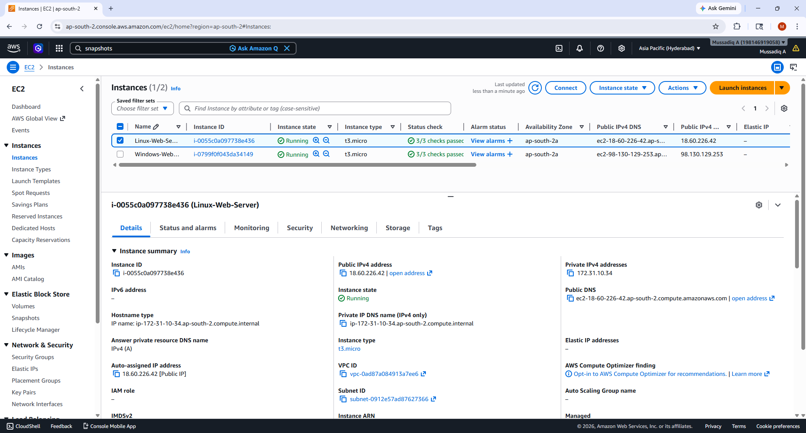
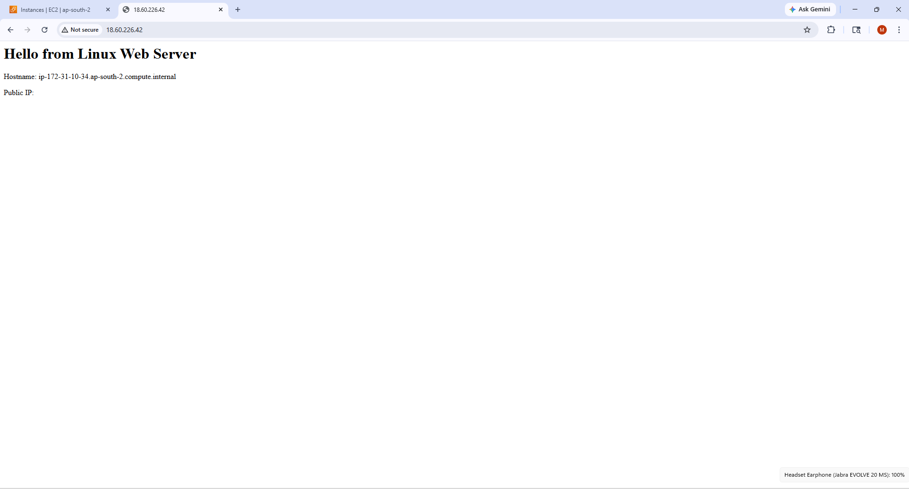
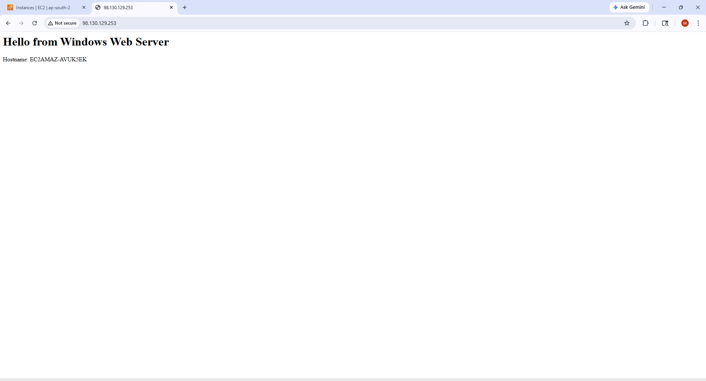
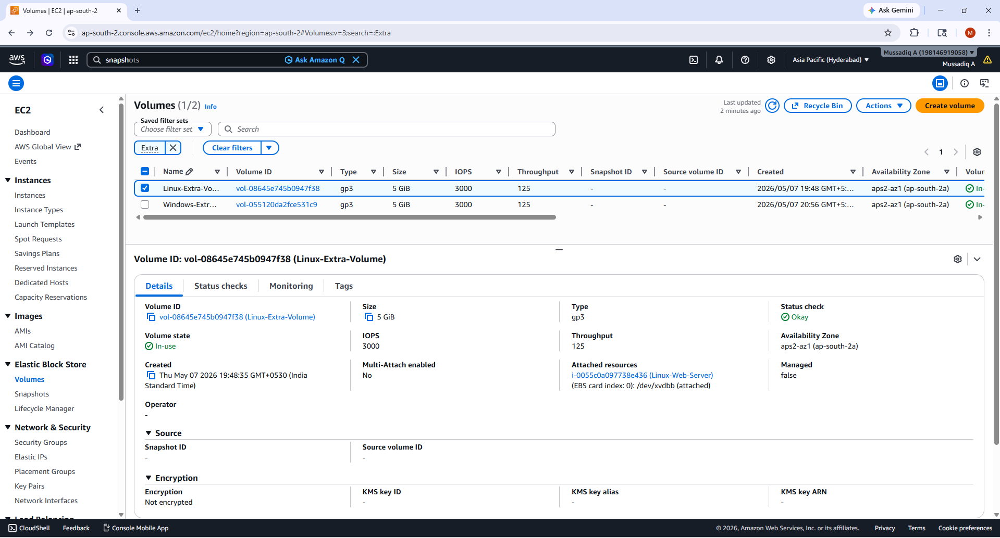
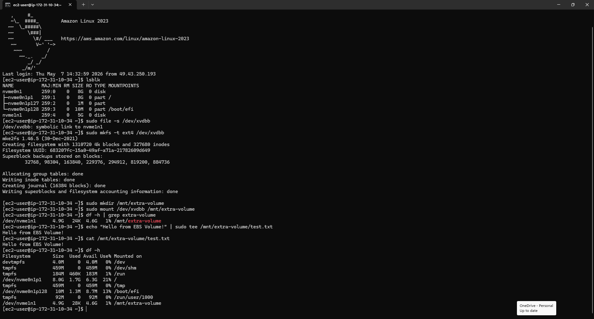
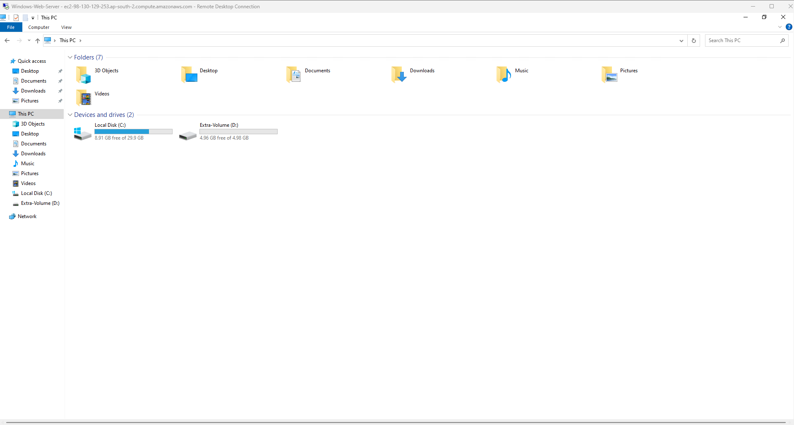
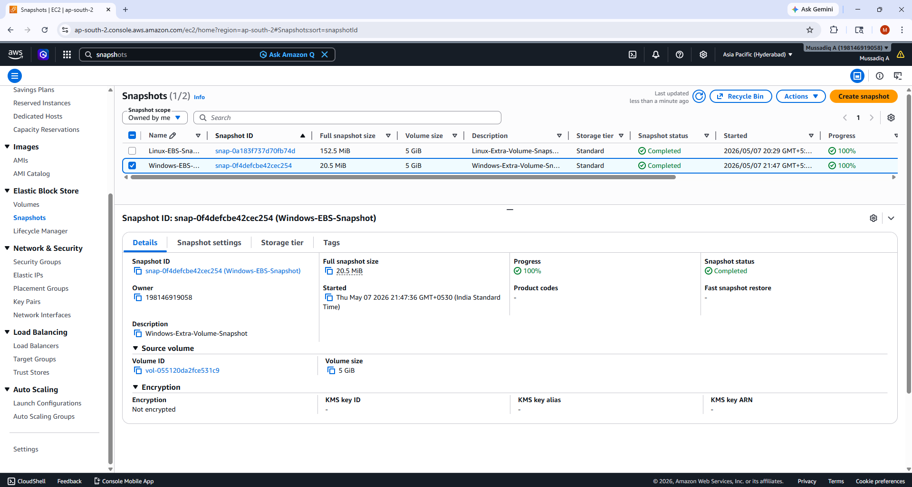
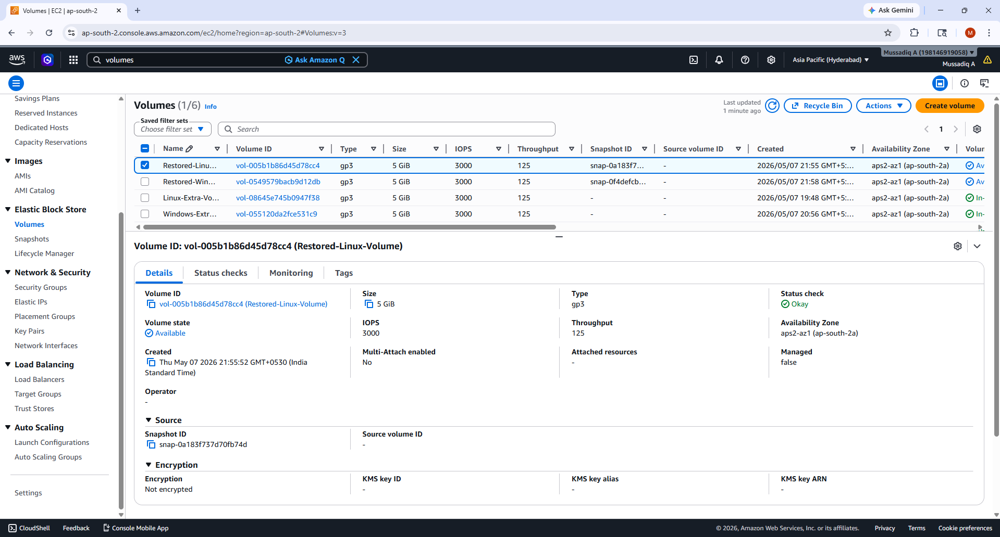

<div align="center">

# ☁️ AWS Task-4 — EC2 + EBS + Snapshots


<br/>

> **Launch EC2 instances (Linux & Windows) with web servers, create and attach 5 GB EBS volumes, take snapshots, and restore volumes from those snapshots.**

</div>

---

## 📋 Table of Contents

- [Task Overview](#-task-overview)
- [Tech Stack](#-tech-stack)
- [Architecture](#-architecture)
- [Step-by-Step Implementation](#-step-by-step-implementation)
  - [Phase 1 — Linux EC2 + Apache Web Server](#phase-1--linux-ec2--apache-web-server)
  - [Phase 2 — Windows EC2 + IIS Web Server](#phase-2--windows-ec2--iis-web-server)
  - [Phase 3 — EBS Volume for Linux](#phase-3--ebs-volume-for-linux)
  - [Phase 4 — EBS Volume for Windows](#phase-4--ebs-volume-for-windows)
  - [Phase 5 — Snapshots](#phase-5--snapshots)
  - [Phase 6 — Restore Volumes from Snapshots](#phase-6--restore-volumes-from-snapshots)
- [Screenshots](#-screenshots)
- [Key Concepts Learned](#-key-concepts-learned)

---

## 📌 Task Overview

| Field | Details |
|---|---|
| **Task** | AWS Task-4 |
| **Goal** | EC2 + EBS + Snapshots (Linux & Windows) |
| **Region** | Asia Pacific (Hyderabad) `ap-south-2` |
| **Services Used** | EC2, EBS, Snapshots |
| **Instance Types** | `t2.micro` (Free Tier) |
| **EBS Volume Size** | 5 GB each |

---

## 🛠️ Tech Stack

| Service | Purpose |
|---|---|
| **Amazon EC2** | Virtual machines (Linux & Windows) |
| **Amazon EBS** | Persistent block storage volumes |
| **EBS Snapshots** | Backup and restore of volumes |
| **Apache (httpd)** | Web server on Linux |
| **IIS** | Web server on Windows Server |
| **SSH** | Remote Linux terminal access |
| **RDP** | Remote Windows desktop access |

---

## 🏗️ Architecture

```
┌─────────────────────────────────────────────────────────────┐
│                     AWS Cloud (ap-south-2)                  │
│                                                             │
│  ┌──────────────────────┐    ┌──────────────────────────┐   │
│  │   Linux EC2 Instance │    │  Windows EC2 Instance    │   │
│  │   (Amazon Linux 2023)│    │  (Windows Server 2022)   │   │
│  │   Apache Web Server  │    │  IIS Web Server          │   │
│  │   Port 80 + 22       │    │  Port 80 + 3389          │   │
│  └──────────┬───────────┘    └────────────┬─────────────┘   │
│             │                             │                  │
│  ┌──────────▼───────────┐    ┌────────────▼─────────────┐   │
│  │  EBS Volume (5 GB)   │    │  EBS Volume (5 GB)       │   │
│  │  ext4 → /mnt/ebs-data│    │  NTFS → Drive D:\        │   │
│  └──────────┬───────────┘    └────────────┬─────────────┘   │
│             │                             │                  │
│  ┌──────────▼───────────┐    ┌────────────▼─────────────┐   │
│  │  Snapshot (Linux)    │    │  Snapshot (Windows)      │   │
│  └──────────┬───────────┘    └────────────┬─────────────┘   │
│             │                             │                  │
│  ┌──────────▼───────────┐    ┌────────────▼─────────────┐   │
│  │  Restored EBS Volume │    │  Restored EBS Volume     │   │
│  └──────────────────────┘    └──────────────────────────┘   │
└─────────────────────────────────────────────────────────────┘
```

---

## 🚀 Step-by-Step Implementation

### Phase 1 — Linux EC2 + Apache Web Server

**Launch Configuration:**
- **AMI:** Amazon Linux 2023
- **Instance Type:** `t2.micro`
- **Security Group Inbound Rules:**
  - SSH (port `22`) — My IP
  - HTTP (port `80`) — Anywhere `0.0.0.0/0`

**User Data script** (auto-runs Apache on first boot):

```bash
#!/bin/bash
yum update -y
yum install -y httpd
systemctl start httpd
systemctl enable httpd
echo "<h1>Hello from Linux Web Server</h1><p>Hostname: $(hostname)</p>" > /var/www/html/index.html
```

> ✅ No manual SSH required — web server is live by the time instance reaches "Running" state.

---

### Phase 2 — Windows EC2 + IIS Web Server

**Launch Configuration:**
- **AMI:** Windows Server 2022 Base
- **Instance Type:** `t2.micro`
- **Security Group Inbound Rules:**
  - RDP (port `3389`) — My IP
  - HTTP (port `80`) — Anywhere `0.0.0.0/0`

**User Data script** (auto-installs IIS on first boot):

```powershell
<powershell>
Install-WindowsFeature -name Web-Server -IncludeManagementTools
Set-Content -Path "C:\inetpub\wwwroot\index.html" -Value "<h1>Hello from Windows EC2 - IIS</h1>"
</powershell>
```

**RDP Connection steps:**
1. EC2 Console → Select Windows instance → **Connect → RDP Client**
2. Click **Get Password** → Upload `.pem` key → Decrypt
3. Download `.rdp` file → Login with decrypted credentials

---

### Phase 3 — EBS Volume for Linux

**Create & Attach:**
1. EC2 → Elastic Block Store → **Volumes → Create Volume**
   - Type: `gp2` | Size: `5 GiB` | AZ: same as Linux instance
2. Select volume → **Actions → Attach Volume** → select Linux instance → device `/dev/xvdf`

**Mount the volume via SSH:**

```bash
# Verify disk is visible
lsblk

# Format the disk
sudo mkfs -t ext4 /dev/xvdf

# Create mount point and mount
sudo mkdir /mnt/ebs-data
sudo mount /dev/xvdf /mnt/ebs-data

# Verify mount
df -h
```

---

### Phase 4 — EBS Volume for Windows

**Create & Attach:**  
Same steps as Phase 3 — select the Windows instance when attaching.

**Initialize the disk inside RDP session:**
1. Press `Win + R` → type `diskmgmt.msc` → Enter
2. New 5 GB disk appears as **Unallocated**
3. Right-click → **Initialize Disk** → MBR
4. Right-click unallocated space → **New Simple Volume** → Format: `NTFS` → Assign drive letter `D:`

---

### Phase 5 — Snapshots

**Linux EBS Snapshot:**
1. EC2 → Volumes → Select the 5 GB Linux volume
2. **Actions → Create Snapshot**
3. Description: `snapshot-linux-5gb-ebs`
4. Wait for status → **Completed** ✅

**Windows EBS Snapshot:**
1. EC2 → Volumes → Select the 5 GB Windows volume
2. **Actions → Create Snapshot**
3. Description: `snapshot-windows-5gb-ebs`
4. Wait for status → **Completed** ✅

---

### Phase 6 — Restore Volumes from Snapshots

**Create volumes from both snapshots:**
1. EC2 → **Snapshots** → Select completed snapshot
2. **Actions → Create Volume from Snapshot**
3. Size: `5 GiB` | Same AZ
4. Repeat for both Linux and Windows snapshots

> ✅ Both restored volumes appear in **"Available"** state — ready to attach to any instance in the same AZ.

---

## 📸 Screenshots

| # | Screenshot | Description |
|---|---|---|
| 1 |  | Both Linux & Windows EC2 instances in Running state |
| 2 |  | Apache web server live on Linux EC2 |
| 3 |  | IIS web server live on Windows EC2 |
| 4 |  | 5 GB EBS volumes created and attached |
| 5 |  | lsblk + df -h showing mounted EBS volume on Linux |
| 6 |  | Disk Management showing 5 GB NTFS volume on Windows |
| 7 |  | Both EBS snapshots in Completed state |
| 8 |  | New EBS volumes created from snapshots |

---

## 💡 Key Concepts Learned

| Concept | Takeaway |
|---|---|
| **EC2 User Data** | Automates instance setup at first boot — no manual SSH needed |
| **EBS Volume** | Must be in the **same Availability Zone** as the EC2 instance to attach |
| **Linux Mount** | Disk must be formatted (`mkfs`) and mounted (`mount`) before use |
| **Windows Disk Init** | New EBS volumes appear as "Unallocated" — must be initialized via Disk Management |
| **EBS Snapshot** | Point-in-time backup of a volume — stored in S3 (managed by AWS) |
| **Restore from Snapshot** | Creates a new volume pre-loaded with all data from the snapshot |
| **IMDSv2** | Newer EC2 instances require a token-based request to access instance metadata |

---

## ⚠️ Cost Reminder

> Stop or terminate EC2 instances and delete unused EBS volumes and snapshots after submission to avoid unexpected AWS charges.

---

<div align="center">

**Made with 🛠️ on AWS Free Tier**


</div>
