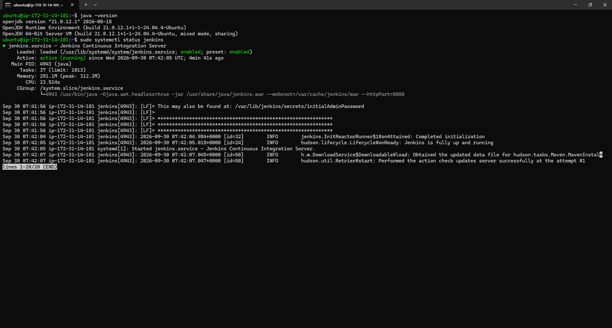

# 🚀 Jenkins on AWS EC2 — CI/CD Setup & Exploration


---

## 📋 Table of Contents

- [Task Overview](#-task-overview)
- [Tech Stack](#-tech-stack)
- [Architecture](#-architecture)
- [Step 1 — Launch EC2 Instance](#-step-1--launch-ec2-instance)
- [Step 2 — Connect via SSH](#-step-2--connect-via-ssh)
- [Step 3 — Install Java 21](#-step-3--install-java-21)
- [Step 4 — Install Jenkins](#-step-4--install-jenkins)
- [Step 5 — Unlock & Setup Jenkins](#-step-5--unlock--setup-jenkins)
- [Step 6 — Jenkins Dashboard](#-step-6--jenkins-dashboard)
- [Step 7 — Create Freestyle Project](#-step-7--create-freestyle-project)
- [Step 8 — Successful Build](#-step-8--successful-build)
- [Step 9 — Create Users](#-step-9--create-users)
- [Step 10 — Matrix-Based Security](#-step-10--matrix-based-security)
- [Screenshots](#-screenshots)
- [Key Learnings](#-key-learnings)

---

## 🎯 Task Overview

> **Task:** Launch Jenkins and explore creating projects and users.
> **Platform:** AWS EC2 (Ubuntu 24.04 LTS)
> **Goal:** Set up a Jenkins CI/CD server on the cloud, create sample build jobs, manage users, and configure role-based access control.

---

## 🛠️ Tech Stack

| Technology | Version | Purpose |
|---|---|---|
| **AWS EC2** | t3.micro | Cloud server to host Jenkins |
| **Ubuntu** | 24.04 LTS | Operating System |
| **Java (OpenJDK)** | 21 | Jenkins runtime dependency |
| **Jenkins** | 2.568.3 LTS | CI/CD Automation Server |
| **Git / GitHub** | Latest | Version control & submission |

---

## 🏗️ Architecture

```
┌─────────────────────────────────────────────────────┐
│                    AWS Cloud                        │
│                                                     │
│   ┌──────────────────────────────────────────┐      │
│   │           EC2 Instance (t3.micro)        │      │
│   │           Ubuntu Server 24.04 LTS        │      │
│   │                                          │      │
│   │   ┌──────────────────────────────────┐   │      │
│   │   │     Jenkins Server               │   │      │
│   │   │     Port: 8080                   │   │      │
│   │   │     Java 21 (OpenJDK)            │   │      │
│   │   └──────────────────────────────────┘   │      │
│   │                                          │      │
│   │   Security Group                         │      │
│   │   ✅ Port 22  — SSH                      │      │
│   │   ✅ Port 8080 — Jenkins Web UI          │      │
│   └──────────────────────────────────────────┘      │
└─────────────────────────────────────────────────────┘
           │                      │
    🖥️ Developer            🌐 Browser
    (SSH Access)         (Jenkins UI :8080)
```

---

## 🖥️ Step 1 — Launch EC2 Instance

Created a fresh EC2 instance on AWS with the following configuration:

| Setting | Value |
|---|---|
| Instance Name | `guvi-jenkins` |
| OS / AMI | Ubuntu Server 24.04 LTS |
| Architecture | 64-bit x86 |
| Instance Type | t3.micro |
| Key Pair | `oct-new-tasks.pem` |
| SSH Port | 22 — My IP only |
| Jenkins Port | 8080 — Open |
| Public IP | `98.130.136.215` |

> ⚠️ **Security Note:** SSH access was restricted to "My IP only" and no unnecessary ports were opened, following the principle of least privilege.

---

## 🔌 Step 2 — Connect via SSH

Since the `.pem` key was on a Windows machine, WSL was used to connect:

```bash
# Copy key from Windows into WSL
mkdir -p ~/.ssh
cp "/mnt/c/Users/mussa/downloads/oct-new-tasks.pem" ~/.ssh/
chmod 400 ~/.ssh/oct-new-tasks.pem

# SSH into EC2
ssh -i ~/.ssh/oct-new-tasks.pem \
    ubuntu@ec2-98-130-136-215.ap-south-2.compute.amazonaws.com
```

> ✅ Successfully connected to Ubuntu on EC2.

---

## ☕ Step 3 — Install Java 21

Jenkins LTS 2.541.1+ requires Java 21 as minimum. Java 17 (default) was replaced:

```bash
sudo apt update
sudo apt install openjdk-21-jdk -y

# Switch default java version if needed
sudo update-alternatives --config java

# Verify
java -version
```

**Output:**
```
openjdk version "21.0.12" 2024-07-16
OpenJDK Runtime Environment (build 21.0.12+7-Ubuntu-1ubuntu2)
```

---

## ⚙️ Step 4 — Install Jenkins

> 🔑 **Important:** Jenkins rotated their signing key in January 2026. The old `jenkins.io-2023.key` no longer works — you must use `jenkins.io-2026.key`.

```bash
# Add the CURRENT Jenkins signing key (2026)
curl -fsSL https://pkg.jenkins.io/debian-stable/jenkins.io-2026.key | \
    sudo tee /usr/share/keyrings/jenkins-keyring.asc > /dev/null

# Add Jenkins repository
echo "deb [signed-by=/usr/share/keyrings/jenkins-keyring.asc] \
    https://pkg.jenkins.io/debian-stable binary/" | \
    sudo tee /etc/apt/sources.list.d/jenkins.list > /dev/null

# Install Jenkins
sudo apt update
sudo apt install jenkins -y

# Enable and start Jenkins
sudo systemctl enable --now jenkins

# Verify it's running
sudo systemctl status jenkins
```

**Expected output:**
```
● jenkins.service - Jenkins Continuous Integration Server
     Loaded: loaded (/usr/lib/systemd/system/jenkins.service)
     Active: active (running) ✅
```

📸 **Screenshot:** `01-jenkins-service-running.png`

---

## 🔓 Step 5 — Unlock & Setup Jenkins

1. Open browser → `http://98.130.136.215:8080`
2. Get the initial admin password:

```bash
sudo cat /var/lib/jenkins/secrets/initialAdminPassword
```

3. Paste the password into the Unlock screen
4. Click **"Install Suggested Plugins"** and wait
5. Create the first admin user:
   - Full name: `Mussadiq Ali`
   - Username, password, email filled in
6. Confirm Jenkins URL → Click **"Start using Jenkins"**

---

## 📊 Step 6 — Jenkins Dashboard

After completing setup, the Jenkins dashboard was accessible confirming:
- Jenkins v2.568.3 LTS is operational
- All suggested plugins installed
- Admin account created and working

📸 **Screenshot:** `02-jenkins-dashboard.png`

---

## 🔨 Step 7 — Create Freestyle Project

Created a Freestyle project called **`hello-world-job`**:

1. Dashboard → **New Item**
2. Name: `hello-world-job`
3. Type: **Freestyle project** → OK
4. Build Steps → **Execute shell**:

```bash
echo "Hello from Jenkins"
```

5. **Save** → **Build Now**

---

## ✅ Step 8 — Successful Build

Opened `hello-world-job` → `Build #1` → **Console Output**:

```
Started by user Mussadiq Ali
Running as SYSTEM
Building in workspace /var/lib/jenkins/workspace/hello-world-job
[hello-world-job] $ /bin/sh -xe /tmp/jenkins-script.sh
+ echo Hello from Jenkins
Hello from Jenkins
Finished: SUCCESS ✅
```

📸 **Screenshot:** `03-successful-build-console.png`

---

## 👥 Step 9 — Create Users

Navigated to **Manage Jenkins → Users → Create User** and created 3 additional users:

| # | Username | Full Name | Role Intent |
|---|---|---|---|
| 1 | `admin` | Mussadiq Ali | Administrator |
| 2 | `developer1` | Developer 1 | Build & configure jobs |
| 3 | `devops1` | DevOps 1 | Build & configure jobs |
| 4 | `tester1` | Tester 1 | Read-only access |

📸 **Screenshot:** `04-jenkins-users.png`

---

## 🔐 Step 10 — Matrix-Based Security

Navigated to **Manage Jenkins → Security → Authorization** and selected **Matrix-based security**.

Configured granular permissions per user:

| User | Overall | Job Permissions |
|---|---|---|
| **Mussadiq Ali** | ✅ Administer | All |
| **Developer 1** | Read | Build, Configure, Read, Workspace |
| **DevOps 1** | Read | Build, Configure, Read, Workspace |
| **Tester 1** | Read | Read only |
| **Anonymous** | ❌ None | None |
| **Authenticated** | ❌ None | None |

> This demonstrates Role-Based Access Control (RBAC) in Jenkins — different users have different levels of access based on their role.

📸 **Screenshot:** `05-jenkins-matrix-security.png`

---

## 📸 Screenshots

| # | File | What it Proves |
|---|---|---|
| 1 | `01-jenkins-service-running.png` | Jenkins installed, active & running via systemd |
| 2 | `02-jenkins-dashboard.png` | Jenkins UI accessible, setup complete |
| 3 | `03-successful-build-console.png` | Freestyle job executed successfully |
| 4 | `04-jenkins-users.png` | Multiple users created in Jenkins |
| 5 | `05-jenkins-matrix-security.png` | Role-based access control configured |

### 01 — Jenkins Service Running


### 02 — Jenkins Dashboard


### 03 — Successful Build Console Output


### 04 — Jenkins Users List


### 05 — Matrix-Based Security Configuration


---

## 💡 Key Learnings

- ✅ **Jenkins key rotation:** Jenkins changed their GPG signing key in January 2026 — always use `jenkins.io-2026.key` for fresh installs
- ✅ **Java version matters:** Jenkins LTS now requires Java 21+; Java 17 is no longer supported
- ✅ **Security groups:** Only expose necessary ports (22 for SSH, 8080 for Jenkins)
- ✅ **Matrix-based security:** Provides fine-grained control over what each user/role can do in Jenkins
- ✅ **Freestyle vs Pipeline:** Freestyle is UI-driven for simple tasks; Pipeline is code-driven for advanced CI/CD workflows
- ✅ **WSL + AWS:** Windows users can seamlessly use WSL for SSH and Linux commands to manage EC2 instances

---

## 📁 Repository Structure

```
Jenkins-Task/
│
├── README.md                        ← You are here
│
└── screenshots/
    ├── 01-jenkins-service-running.png
    ├── 02-jenkins-dashboard.png
    ├── 03-successful-build-console.png
    ├── 04-jenkins-users.png
    └── 05-jenkins-matrix-security.png
```

---

<div align="center">

**Made with ❤️ as part of GUVI DevOps Task**


</div>
